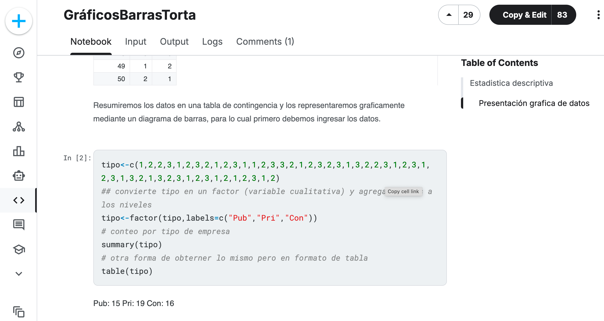
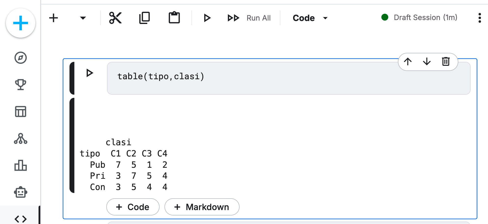

## Guía Rápida: Uso de Kaggle para el Taller de Estadística computacional  

Como futuros estadísticos, es fundamental que comiencen a interactuar con plataformas colaborativas de datos.


En [Kaggle.com](https://www.kaggle.com/code/mmoralesr/clase1rcomocalculadora) encuentras el código, en lenguaje R, de la clase __R como una calculadora__.  

[Clic aquí para ir al código](https://www.kaggle.com/code/mmoralesr/clase1rcomocalculadora)

## Preparándose para trabajar en Kaggle. 

### Paso 1: Creación de Usuario (Desde cero) 

Para poder ejecutar el código y hacer sus propias pruebas, deben tener una cuenta activa:

1. Ingresa a [Kaggle.com](Kaggle.com). 

2. Haz clic en el botón "Register", Véase la figura -@fig-PaginaPrincipalKaggle (arriba a la derecha).  

{#fig-PaginaPrincipalKaggle } 

Te recomiendo usar la opción "Register with Google" con tu correo institucional de la Universidad de Córdoba para facilitar la verificación, véase la figura -@fig-paginaregistro

3. Sigue los pasos para elegir un nombre de usuario y acepta los términos de servicio.

```{r}
#| label: fig-paginaregistro
#| fig-cap: "Pagina de registro de Kaggle.com"
#| echo: false


```

## Paso 2: Exploración del Notebook 

1. Una vez que hayas hecho clic en el [enlace del curso:](https://www.kaggle.com/code/mmoralesr/clase1rcomocalculadora) Verás un documento que combina texto explicativo y bloques de código (esto se llama Notebook).

2. En la parte superior derecha, busca un botón que dice "Copy & Edit", véase la figura -@fig-PaginaNotebook . 


```{r}
#| label: fig-PaginaNotebook
#| fig-cap: "Notebook de Kaggle.com"
#| echo: false



```


Al hacerlo, se creará una copia privada en tu cuenta para que puedas modificar el código sin miedo a dañar el original.


## Paso 3: Ejecución del Código

1. Dentro del editor de Kaggle: Verás celdas con código en R (o Python). 

{#fig-EjecucionCodigo}.


2. Para ejecutar cada bloque y generar los gráficos, haz clic en el icono de "Play" ($\blacktriangleright$) al lado de cada celda o presiona Ctrl + Enter. 

3. Observa cómo los datos crudos se transforman en tablas de frecuencia y gráficos de sectores siguiendo las fórmulas que vimos en las diapositivas.

## Paso 4: Exportar resultados

Si necesitas usar un gráfico generado en Kaggle para tu taller: 

1. Haz clic derecho sobre la imagen generada y selecciona "Guardar imagen como...".

2. Asegúrate de citar la fuente del dataset si estás usando datos externos

## Tips importantes de Rigor para el Estadístico 

1. No solo corras el código: Lee los comentarios. 

2. En estadística, el código es solo la herramienta; la interpretación del resultado es tu verdadero trabajo.

3. Verifica la variabilidad: Prueba cambiar algunos datos en la tabla de entrada y observa cómo cambian los ángulos ($\theta_i$) en el gráfico de sectores.


 