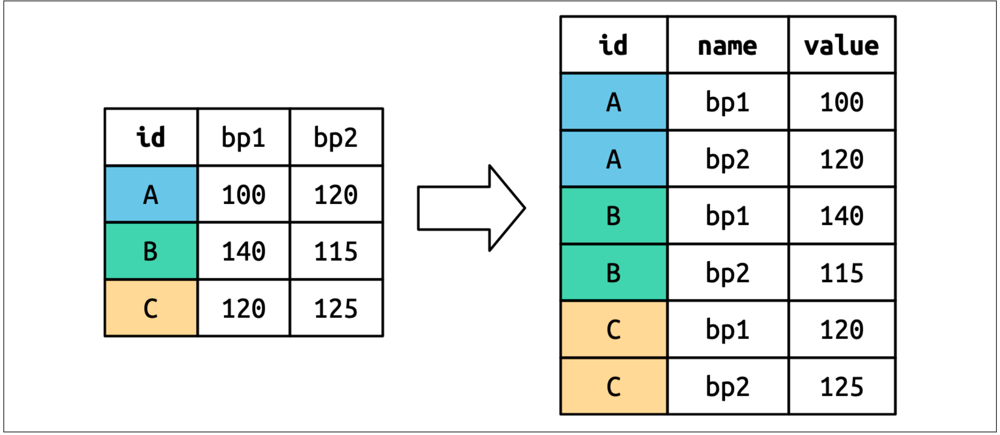

## Introducción

Aprenderemos a usar Quarto Markdown para general documentos que contienen texto, tablas, gráficos, ecuaciones, todos en un mismo lugar.

### Formateo de texto

En Quarto podemos poner texto en **negrita** y en *cuarsiva*, tambien funciona con **negrita** y también con *cursiva*

### Viñetas

En Quarto Markdown las viñetas se hacen de la siguiente forma:

* Mi primera viñeta
* Mi segunda viñeta
  * Mi primea sub-viñeta
  * Mi segunta sub-viñeta
    - Sub sub viñeta.
    - Segunda segunda.  
    

### Enumeraciones 

Las enumeraciones funcionan de la siguiente forma

1. Primera enumeacion
2. Segunda
   1.  Sub enumeracion
   2.  Sub-enumeracion 
2. Tercera  


### Inserción de código. 

```{r}
#| message: false
#| warning: false 
#| echo: true  
#| eval: true  
#| results: hide 
library(tidyverse)
data(mpg) 
medias=with(mpg,tapply(hwy,class,mean)) 
medias
```


El promedio mas grande de la variable `hwy`   es `r round(max(medias),2)`, y se obtiene con la clase de carro `r names(medias)[which.max(medias)]`     


### Impresión de tabla 


En la tabla -@tbl-tablamedias  se muestran las medias de la columna `hwy` para cada clase de carro.  

```{r}
#| echo: false
#| label: tbl-tablamedias 
#| tbl-cap: 'Medias de hwy para cada clase carro' 
library(knitr) 
kable(medias)   
```

En la tabla -@tbl-tablamedias se muestran las medias de `hwy` desagregadas por cada nivel del factor clase.  

### Gráficos  

El gráfico -@fig-rendimientovscilindraje muestra que la relación entre rendimiento y cilindraje. 

```{r}
#| fig-cap: "Rendimiento en función del cilindraje" 
#| label: fig-rendimientovscilindraje 

with(mpg,plot(displ,hwy,pch=20,xlab="Cilindraje",,ylab="Rendimiento (m/g)"))  
```


### Lectura de datos 


```{r}
#| fig-cap: "Rendimiento en función del cilindraje" 

#| fig-width: 12
#| fig-height: 4


with(mpg,plot(displ,hwy,pch=20,xlab="Cilindraje",,ylab="Rendimiento (m/g)"))  
```


### Inserción de figuras externas 

En la @fig-graficoexterno 

{#fig-graficoexterno}    


## Formulas matemáticas en quarto 

Si $x_1, x_2, \ldots , x_n$ es un conjunto de $n$ datos, entonces su varianza se define de la siguiente manera 
$$
\begin{aligned}
S^2&=\frac{\sum\limits_{i=1}^n(x_i-\bar x)^2}{n-1} 
\\
&=\frac{\sum_{i=1}^nx_i^2-n\bar x^2}{n-1}
\end{aligned}
$${#eq-formulavarianza}

En la fórmula -@eq-formulavarianza, $\bar x$ es la media aritmética de los datos, la cual se calcula mediante
$$
\bar x = \frac{\sum_{i=1}^n x_i}{n} 
$$

### Ejemplo 

Para ilustrar el cálculo de la varianza, consideremos los datos de la tabla 

```{r}
#| echo: false
#| label: tbl-DatosEjemploVar
#| tbl-cap: 'Datos para ilustrar el uso de la fórmula -@eq-formulavarianza'  
x=c(4,6,1,2,3,1) 
kable(matrix(x,nrow = 2)) 
```

Para calcular la varianza, primero debemos calcular la media de los datos, de la siguiente forma
$$
\bar x = \frac{ `r x[1]`  + `r x[2]` + \cdots + `r x[6]` }{`r length(x)`}=\frac{`r sum(x)`}{`r length(x)`}=`r round( mean(x), 3 )` 
$$

A la raíz cuadrada de la varianza, se le conoce como desviación estándar y se simboliza con $S$, es decir $$S=\sqrt{S^2}=\sqrt{\frac{\sum\limits_{i=1}^n(x_i-\bar x)^2}{n-1}}$$  

### Escritura de funciones 

Para escribir funciones en \LaTeX, debemos usar los comandos adecuados, por ejemplo, para escribir la función exponencial, no es correcto escribir asi $f(x)=exp(x)$ , lo correcto es $f(x)=\exp(x)$, $ln(x)$ correcto $\ln(x)$ $sin(x)$ correcto $\sin(x)$, 
$$\lim_{x \to \infty} f(x)$$ 


